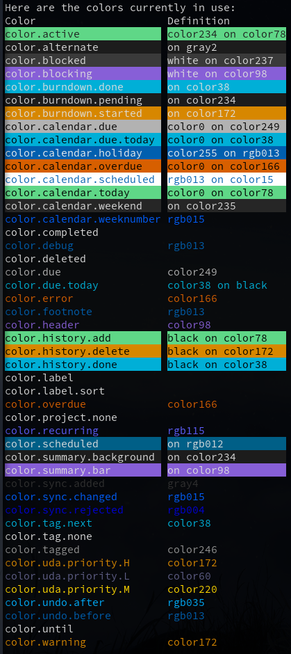

# Spaceduck theme for taskwarrior

This is a simple theme that attempts to create a taskwarrior color scheme in
line with [Spaceduck](https://github.com/pineapplegiant/spaceduck).

Taskwarrior supports 256 terminal colors (not "TrueColor") so there are a few
colors in the Spaceduck palette that aren't possible to recreate with `task
color`.

# Color legend

The output of `task color legend` with this theme enabled:

